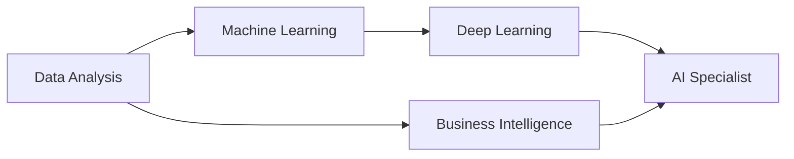

<div align="center">

# 👋 Hello, I'm Qusay Alhasanat

### Data Analyst | Aspiring Data Scientist | AI Enthusiast


</div>

---

<div align="center">

[](mailto:qusay.alhasanat1@gmail.com)
[](https://www.linkedin.com/in/qusay-alhasanat)
[](https://www.kaggle.com/qusayalhasanat1)
[](https://github.com/Qusay-Alhasanat)


</div>

---

## 🚀 About Me

```python
class DataAnalyst:
    def __init__(self):
        self.name = "Qusay Alhasanat"
        self.role = "Data Analyst"
        self.future_goal = "Data Scientist & AI Specialist"
        self.location = "Palestine"
        
    def current_focus(self):
        return [
            "Analyzing real-world data and extracting insights",
            "Building practical, end-to-end data analysis projects",
            "Strengthening foundations before moving deeper into ML",
            "Improving English alongside technical growth"
        ]
    
    def philosophy(self):
        return "Consistency beats perfection. Every dataset has a story."
```

My journey into data didn’t start with perfection — it started with curiosity.
I’m building myself step by step in **Data Analysis**, aiming to grow into a strong **Data Scientist and AI Specialist**.

I enjoy working with messy, real-world data — cleaning it, exploring it, and turning it into something understandable and useful.
I believe progress comes from showing up every day, learning honestly, and building things that actually work.

---

## 🧩 What I Can Do With Data

* Clean and prepare real-world datasets (missing values, outliers, duplicates)
* Perform Exploratory Data Analysis (EDA) to discover patterns and trends
* Build clear visualizations that communicate insights
* Answer real business questions using data
* Prepare structured data for Machine Learning models

---

## 📌 Featured Projects

### 🛍️ Retail Customer Behavior Analysis

* Analyzed customer purchasing behavior to identify patterns and customer segments
* Cleaned and prepared transactional retail data (missing values, outliers, duplicates)
* Performed Exploratory Data Analysis (EDA) to understand spending habits and frequency
* Extracted actionable insights that could support marketing, targeting, and retention decisions
  🔗 Repository: [https://github.com/Qusay-Alhasanat/customer-purchase-data-analysis.git](https://github.com/Qusay-Alhasanat/customer-purchase-data-analysis.git)

---

## 🛠️ Tech Stack & Tools

<div align="center">

### Core Skills


### Business Intelligence


### Currently Learning


### Tools


</div>

---

## 📊 GitHub Stats

<div align="center">


</div>

---

## 📚 How I Learn

* Learn concepts, then apply them immediately in projects
* Focus on understanding the “why”, not just the “how”
* Prefer practical work over memorization
* Believe consistency and discipline create real skill

---

## 🎯 Learning Path



---

## 💭 Philosophy

> *"I show up every day, learn honestly, build patiently, and improve steadily."*

---

## 🤝 Let’s Connect

<div align="center">

I enjoy collaborating on data projects, sharing ideas, and learning with others in the data and AI community.

📧 **Email:** [qusay.alhasanat1@gmail.com](mailto:qusay.alhasanat1@gmail.com)
💼 **LinkedIn:** [Qusay Alhasanat](https://www.linkedin.com/in/qusay-alhasanat)
📊 **Kaggle:** [qusayalhasanat1](https://www.kaggle.com/qusayalhasanat1)

---

⭐ **From Qusay Alhasanat** — Turning data into understanding, one dataset at a time.

</div>
